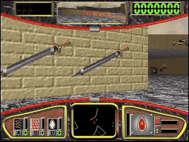
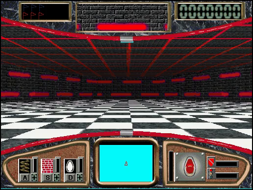
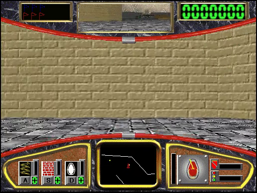
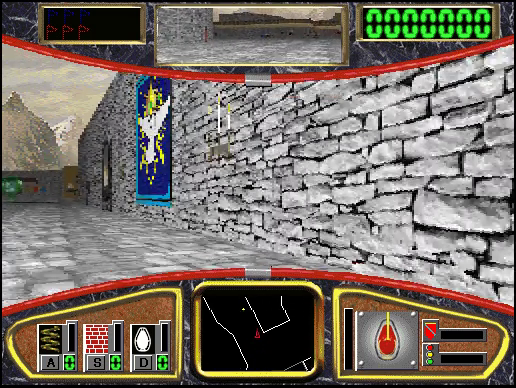
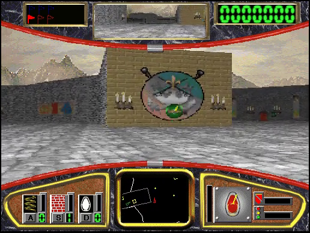

# Hover! — Static Recompilation



Static recompilation of **Microsoft Hover!** (1995), the capture-the-flag
maze racer from the Windows 95 CD, from its shipping Win32 executable to
native C.

Built on the [pcrecomp](https://github.com/sp00nznet/pcrecomp) toolchain and
following its shared house style (layout, CLI, conformance harness, headless
mode).

## Status: **v0.1.0-dev, alpha. Boots, starts a game, and plays level 1 to the end, recompiled throughout.**

| Stage | State |
|---|---|
| P0: identify the binary | done: `HOVER.EXE`, MSVC 2.x + static MFC 3, no protection; `DASHRES.DLL` is resources only |
| Function catalog (`disasm32`) | 5,090 functions, 96.6% of the code bytes |
| Lift (`run_lift.py`) | **whole program**: 5,135 functions, 0 lift errors, 426K lines of C |
| Host (`build/hover.exe`, 32-bit, pcrecomp `native32`) | 350 imports: 339 bound to real Windows, 11 shimmed. Nothing native from the original runs |
| Graphics | GDI and DIB sections, as the original: nothing to replace |
| Title / attract screen | **runs** |
| Gameplay | F2 starts level 1; driving, turning, the radar, flags, pods and the opponents all run. A two-minute soak ran to the opponents winning, with no fault |
| Sound and music | `waveOut` and MIDI go to the real devices. Played in a windowed run; not checked note by note |
| Windowed mode | plays (keyboard and mouse, the original's window and menus) |
| Headless mode | `--headless --record out.mp4`, with `--key` for scripted input. Never shows or activates a window ([docs/host.md](docs/host.md)) |
| Conformance harness | **11/11** milestones (boot, start, drive, 1,000 frames), 0 lift errors, 0 unresolvable tail calls ([tools/conformance.py](tools/conformance.py)) |

One toolkit fix was needed, [pcrecomp#24](https://github.com/sp00nznet/pcrecomp/pull/24), open until it merges
([docs/toolkit.md](docs/toolkit.md)).

## Screenshots

Real output of `build\hover.exe --headless --record`, recompiled code
throughout:

| | |
|---|---|
|  |  |
|  |  |

## What is not in this repo

Nothing from the game: no executable, no data, no disc image, and **no
generated source**. The recompiled C is produced on your machine from your
own copy by `run_lift.py`, into `src/recomp/gen/`, which is gitignored. The
tool ships; its output never does.

## Getting Started

You need **your own copy of Hover!**: the Windows 95 CD (it is in
`FUNSTUFF\HOVER`), the Hover! CD, an ISO or BIN/CUE of either, or a zip of
the game folder. Nothing is downloaded for you.

### Quick start

1. Download this repository (the green **Code** button, then **Download ZIP**)
   and unzip it somewhere with 1 GB free.
2. Double-click **`Setup.cmd`**.

It checks for Python 3.10+, the `pefile` and `capstone` packages, the pcrecomp
toolkit and the Visual Studio 2022 C++ compiler, and **asks** before
installing any of them, saying what and how big. It finds Hover! in your
drives, or asks where it is (a drive, a folder, or a `.zip`/`.iso`/`.cue`/
`.bin`). Then it copies the game into `game\hover`, finds every function,
recompiles `HOVER.EXE` and builds `build\hover.exe`. A rerun skips the
finished steps. If it stops, it says why in one sentence, and the details are
in `setup.log`.

It ends with a **`Hover!`** shortcut in the folder. Double-click it to play.

### Step by step

Prerequisites: Windows 10/11, **Python 3.10+** (`py -3 --version`), **git**,
**Visual Studio 2022** (or its Build Tools) with *Desktop development with
C++*, **ffmpeg** on `PATH` for `--record` only, and the pcrecomp toolkit
cloned **beside** this repository as `tools`:

```
some-folder\
  tools\                        <- git clone https://github.com/sp00nznet/pcrecomp tools
  hover\                        <- this repository
```

Until the jump-table fix ([pcrecomp#24](https://github.com/sp00nznet/pcrecomp/pull/24)) merges, use its branch:
`git -C tools checkout fix/generate-jump-table-self-arm` ([docs/toolkit.md](docs/toolkit.md)).

1. Python packages:
   ```
   py -3 -m pip install --user pefile capstone
   ```
2. Your copy's files into `game\hover` (from a drive, a folder, a zip or an image):
   ```
   py -3 tools\gamefiles.py E:\
   py -3 tools\gamefiles.py hoverwindows95.zip
   ```
   Expected: `reading 85 files from hoverwindows95.zip!hover.zip!HOVER!/` (or
   `copying ...` for a folder) then `done: ...\game\hover`.
3. The function catalog (under a minute):
   ```
   py -3 tools\catalog.py
   ```
   Expected, at the end: `[*] Functions: 5090  (thunks=12, leaves=1238)`.
4. Recompile to C:
   ```
   py -3 run_lift.py
   ```
   Expected:
   ```
   [*] HOVER.EXE: base=0x00400000 code=0x00401000-0x0045F600 IAT=350 catalog=5090
   [*]   45 outside branch targets added
   ============================================================
     lifted 5135   errors 0   no terminator 8
   ```
5. Build (the 64-bit-hosted MSVC targeting x86, CMake and Ninja; all three come
   with the C++ workload):
   ```
   build.cmd
   ```
   Expected: `Linking C executable hover.exe`.
6. Check it without opening a window:
   ```
   build\hover.exe
   ```
   Expected: `[bind] 0x00400000: 339 native, 0 guest, 11 shimmed, 0 unresolved`
   and `(dry run: image mapped and bound; --run enters 0x0043FB73)`.
7. Play: `build\hover.exe --run`. The original warns that you are "not
   running a 256 color video driver"; click OK, it runs fine.

The usual trip-ups: `python` opening the Microsoft Store (that is Windows' alias
placeholder; use `py -3`, or turn the alias off in *Settings > Apps > Advanced
app settings > App execution aliases*); a freshly installed Python not being on
`PATH` until you open a new window; and a pcrecomp without the jump-table fix
(`Setup.cmd` names it; the lifted game then faults when level 1 starts).

## Usage

```
build\hover.exe --run                                         # play, in the original's window
build\hover.exe --run --headless --record out.mp4 --key F2@2000 --key UP@8000+6000 --frames 600
build\hover.exe --run --headless --watchdog 60 --native-trace # every Windows call
py -3 tools\conformance.py                                    # milestones and lift health, vs the baseline
```

In the game: F2 starts, the arrow keys drive, F3 pauses, and the object is
to collect your opponents' blue flags before they collect your red ones.

| Flag | |
|---|---|
| `--run` | enter the game (without it: map, bind and stop) |
| `--headless` | a cloaked window that never reaches a screen or takes focus; message boxes go to stderr, dialogs answer OK, and a fresh settings profile each run |
| `--record out.mp4` | pipe the window to ffmpeg (30 fps, wall-clock paced) |
| `--frames N` | exit after N frames of the 3D view |
| `--diff A,B` | print how much of the window changed between frames A and B |
| `--key NAME@MS[+HOLD]` | press a key MS milliseconds after entry, for HOLD ms (default 100): `UP`, `LEFT`, `F2`, `SPACE`, a letter, or a VK code |
| `--game DIR` | the game folder (default `game\hover`) |
| `--watchdog S` | stop after S seconds and say where every thread was |
| `--native-trace`, `--callbacks` | one line per call into Windows, or back from it |

`py -3 tools\addr2line.py ADDR ...` names host addresses from a fault report
or a watchdog dump.

## Building from source

Steps 3 to 5 above. `PCRECOMP` (Python) and `-DPCRECOMP=` (CMake, through
`set CMAKE_ARGS=...` for `build.cmd`) point at a toolkit checkout other than
`..\tools`; the lifter and the runtime must come from the same tree. How the
pieces fit is [docs/architecture.md](docs/architecture.md); what the host
does and why is [docs/host.md](docs/host.md).

## License

MIT, for the code in this repository ([LICENSE](LICENSE)). Hover! itself is
© 1995 Microsoft Corporation; none of it is here.
