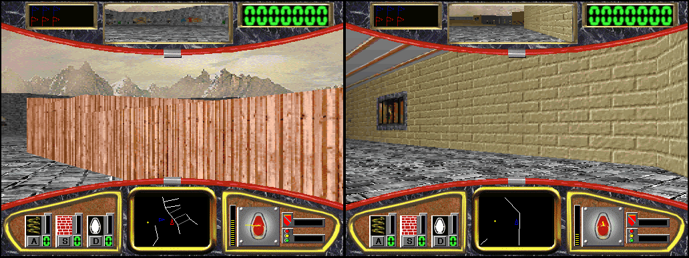
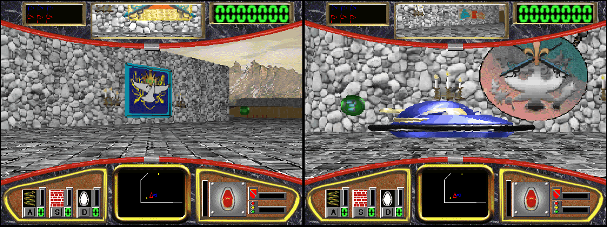

# Multiplayer

Hover! (1995) is one human against robots. This is how the port turns it
into up to four players on one PC today (`src/runtime/mp.c`), and the
research the online play builds on. Addresses are `HOVER.EXE` VAs;
the lifted function for each is `sub_XXXXXXXX`.

## What the engine is

**Objects** (names and sizes from the MFC `CRuntimeClass` records):

| Class | Size | vtable | Constructor | |
|---|---|---|---|---|
| `CGameObj` | 0x84 | 0x4BC380 | 0x40D150 | base of everything in the world |
| `CPlayer` | 0x1FC | 0x4BC910 | 0x41AC30 | a craft: physics, pods carried, flags carried |
| `CHumanPlayer` | 0x1FC | 0x4BCBE0 | 0x421FA0 | the one human, embedded in the document |
| `CRobotPlayer` | 0x688 | 0x4BCCE0 | 0x4220A0 | a robot: seven AI state objects at +0x264..+0x5FC |

The document (`CBumperDoc`) is `[0x00460970]`. The human is **inside** it at
`doc+0x818C`; nothing else points at the human, so the camera, the HUD and
the robots' chasing all compute that address. `doc+0x83A8` is a `CObList` of
everything that thinks (the human first, then hunters, then flag-runners,
then pods while their effect runs), `doc+0x83E4` the human's score and
`doc+0x83E8` the robots' flag count. All dynamic lists: 16 robots ran to a
normal ending. The ceiling is start spots: the start picker (0x417D40)
retries a random `ROBOT_nn` forever while something is within 0x50, and
MAZE1/2/3 have 17/18/17.

`CPlayer` fields that matter here:

| Offset | | Offset | |
|---|---|---|---|
| +0x44/+0x48 | x/y (16.16) | +0x19C | heading (512 a turn, 16.16) |
| +0x1AC/+0x1B0 | velocity | +0x1F0 | **turn** input, -1.0..+1.0 |
| +0x1F4 | **thrust** input | +0x1F8 | is human |
| +0x14C | spin-out timer (-1 = none) | +0xB4/+0xC0 | flags carried |

Teams go by class: `CFlag`'s pickup check (0x414470) gives robot flags only
to `CHumanPlayer` and human flags only to `CRobotPlayer`. `CRobotPlayer+0x21C`
is a personality (1 hunter, 0 flag-runner), not a team.

**The tick.** A 50 ms `timeSetEvent` (set at 0x412804, callback 0x408AA0)
posts `WM_USER` to the view. Its handler 0x408AF0 polls the keyboard into the
view's steer flags, then 0x408D00 runs the state machine on `[0x00460728]`
(2 countdown, 3 playing, 4-5 level end) and 0x427D40 the tick: every
thinker's `Think` (vtable slot 7), collisions (0x40A650), and the hand-off to
the render thread (0x40DC20). The human's Think (0x409180) turns the steer
flags into turn/thrust; a robot's (0x409300) runs its AI state, then
0x409350 steers toward its target and writes fractional turn/thrust. Both
then call `CPlayer::Think` (0x409110), the shared physics.

**Determinism.** The step is fixed: once per tick, never scaled by a clock.
The simulation, input, the loader and the AI's `rand` all run on the UI
thread; the render thread only writes the view and its DIBs. The clock reads
are the level seed (`time()`, pinned by the host), a 500 ms sound throttle
and frame-rate counters, none of which the world reads. With the seed pinned
and keys applied by tick, separate runs (two of them at the same time
included) stayed byte-identical in world and entity state through 610 ticks;
moving one key by one tick diverged by tick 90. Slow machines drop ticks
(flag `[0x004C4CE4]`) rather than catch up, and every peer needs the same exe
(floating-point division goes through the CRT's FDIV check, 0x43EC07).

**The renderer** runs on its own thread: command 2 of its loop (0x41EE51) is
the frame draw, 0x00402250, a thiscall with no stack arguments. It reads the
camera from the human (heading `+0x88`, the craft itself as the position
source, eye height `+0x8C`), sets camera `[view+0xC8]` with 0x406C00 and
renders with 0x406090. The rear-view mirror is a second camera
(`[view+0xCC]`) drawn in the same call, so the renderer is already called
twice a frame; its state is statics (`0x4A44xx`), so passes must stay on the
one thread, one after another. The radar (0x407160), speed (0x405A10),
powerup gauges and score read the human and the one view. Six built-in
layouts (320x240 to 700x525, each with its own dashboard art in DASHRES,
table at 0x4609A0) are chosen by the window size.

## Split screen (in)

*Recomp > Multiplayer*, `[mp] players=` in `hover.ini`, or `--players N`:

- **Seats.** Player 1 is the game's human (keyboard, and controller 1).
  Players 2-4 each get a robot of their own: every level's table entry
  (0x004C4000, 0x58 a level, flag-runners at +0x2C) gains one flag-runner per
  extra player, so the level keeps the AI it was designed with, and the seats
  are the last robots the loader creates. `CRobotPlayer::Think` is reached
  only through its virtual call, so `recomp_lookup_manual` hands it to
  `seat_think`, which writes the seat's controls into turn/thrust and runs the
  physics; every other robot runs its AI.
- **Controls.** Controller 2-4 for players 2-4 (analogue: stick or triggers
  for thrust, stick or d-pad to turn); player 2 also has I/J/K/L on the
  keyboard.
- **Views.** `run_lift.py` patches the frame draw's three camera reads to ask
  `hover_cam_obj()`, and its call on the render thread (0x0041F012) to
  `hover_render_views()`, which draws once per player, player 1 last, from
  the same registers each time. host.c puts each pass's blits in that
  player's cell of the capture buffer (2 side by side, 3-4 two by two), and
  blits outside a pass (the dashboard's background, painted in `WM_PAINT`)
  in every cell. The presenter fits the bigger picture to the monitor.
- **Controls.** Controller 2-4 for players 2-4; player 2 also has I/J/K/L to
  drive and U/O/P for jump/wall/cloak on the keyboard.

- **Dashboards.** Each view's dashboard is its own player's. The radar
  (centre and heading), the speed dial and bar and the height gauge read the
  human; those reads are patched to `hover_cam_obj()` too. The counters,
  score, flag rows and pod gauges are numbers the view keeps (written by the
  game as they change, drawn only when marked dirty): `hover_render_views()`
  marks them dirty every pass and, for a robot seat, swaps in that seat's own
  for the pass: its pod counts (the craft's `+0x114` jumps, `+0xF8` cloaks,
  `+0xDC` walls), its pod gauges (its own block, below), its side's score and
  the flags it carries. The dashboard is otherwise drawn incrementally
  straight to the window; with several views the game's own full-dashboard
  mode (`[0x004C4CA8]`, composed off screen, blitted whole) is forced on, so
  every cell gets a whole dashboard of its own.

  

- **Powerups for every seat.** The pods' pickup check (0x0040CB40) took only
  the human; a seat's craft passes too (AI robots still do not). A seat's
  jump/wall/cloak buttons use its pods through the game's own Use (vtable
  slot 9, as the human's key handler 0x0040B540 does), one per press, jump
  with the human's checks (not in the air, not already jumping). The wall
  faces the seat's heading (0x0042B52C read the human's), a map eraser a
  seat takes does not wipe player 1's map (0x00422589), and every pod gauge
  write (14 sites through 0x00401140) goes to the seat's own block
  (`hover_pod_hud`), never to player 1's view.
- **Player 1 is seen.** The human never had a sprite: a robot's vtable slots
  15/16 (0x0040A4C0/0x0040A590) pick a sprite frame and create and move a
  sprite (`craft+0x78`, a 0x70-byte object in the world's draw list
  `[doc+0x188]`), and the human's are `CPlayer`'s plain ones. With more than
  one seat the human runs the robot versions (they use only `CPlayer` fields),
  the level teardown forgets the sprite with the world it lives in
  (0x004149C4), and each pass turns every sprite to face its own camera
  (`face_sprites`, the same 32 frames and mirrors the game uses) and skips
  the camera craft's own (0x00406343, `hover_sprite_visible`).

  

- **Teams.** The game decides sides by class: `CFlag`'s take test
  (0x00414470) gives robot flags only to the human and human flags only to
  robots. It is replaced (through its virtual call) by a test by side, so a
  seat can play on either: `[mp] teams=` or `--teams`, one letter a seat,
  `h` or `r` (`hh` puts player 2 with player 1; the default is every robot
  seat on the robots' side). The scoring (0x0041AE40) already goes by the
  flag's side; its "all flags taken" test and flag gauge now count the
  side's flags, not the taker's alone (0x0041AFF6, 0x0041B05C,
  `hover_team_flags`). Hunters look for and chase the nearest craft on the
  human's side instead of player 1 alone (0x0042ED09, 0x0040A810,
  `hover_quarry`). Online, the host's teams are part of the session.

**Not yet:** the radar's explored walls are shared: the wall renderer sets
bit 8 of each wall's `+0x24` byte (0x402671, 0x4029ED, 0x402F4B, 0x40E3F4;
the radar tests it at 0x401C3A, 0x401D47, 0x404C05, 0x404EFE; a level clears
it at 0x4225D9/0x4225F4), so every pass explores for everyone. A cloaked
seat is not hidden from the others' views; seats get no pickup sounds; a
seat on the robots' side is not chased by hunters; player 1 wears the
robots' sprite art (there is no other). A change of player count takes effect
from the next level load.

Checked headless: 2 and 4 players on a pinned seed, each view distinct and
following its own craft (docs: the conformance run has a 2-player run), and
windowed at the console (1824x685 for two players on a 1920x1080 monitor).

## Online play (in)

`src/runtime/net.c`. Lockstep: every PC runs the same world from the same
inputs, and only the inputs cross the network.

**Starting one.** The host chooses *Recomp > Multiplayer > Host an online
game* (or `--host [PORT]`, default UDP 7795): the game starts at once with
`[net] seats=` seats (`--seats N`, default 8), and every seat nobody holds is
a robot. The host's join code (`HOVER-XXXXX-XXXXX`, its address and port, a
Tailscale address first if it has one) goes on the clipboard; anyone copies
it and chooses *Join* (or `--join CODE` / `--join HOST[:PORT]`). A PC brings
as many local players as its split screen is set to (`--local N`), up to 4.
`--clients N` makes the host wait for N PCs and start them together instead.

**Joining and leaving while it runs.**

- *Seats.* The host is the one authority on who holds which seat. A seat
  nobody holds carries an AI mark in the input record, so on that tick every
  PC lets the robot's own AI drive it: empty seats, players who left, and
  players still catching up.
- *Joining.* A late joiner gets the session's start (its first level and
  seed) and replays every input since tick 0 at full speed, pulling the log
  from the host; the desync hashes check the replay. Caught up, it says so,
  and the host gives it its seats from 20 ticks ahead, which everyone
  already has the AI's records for.
- *Leaving.* A PC that quits says goodbye (every exit path), or is counted
  gone after 4 s of silence; its seats go back to the AI from the first tick
  the host has no input for. If the host leaves, the game ends for everyone.
- *The game's own Start Game, Start At and Pause* would change one PC's game
  and not the others', so they are greyed and their keys dropped while
  online.

**How it stays in step.**

- *The gate.* Online, the game's 50 ms timer is the host's: `timeSetEvent`
  for the tick callback (0x00408AA0) is taken over, and a driver thread
  calls the game's callback for tick N only once tick N-1 has been handled
  (the flag at `[0x004C4CE4]` is clear again) and every seat's input for
  tick N has arrived. It stalls rather than skips, and never bursts to catch
  up. Tick 0 is the first tick of the session's first real level: the
  attract demo, which may still be running when the session starts, keeps
  its own timer.
- *Inputs.* Between ticks each PC samples its players for tick N+3 (turn,
  thrust, jump/wall/cloak) and sends them; every packet repeats the last 8
  ticks, so a lost packet costs nothing. Clients send to the host, and the
  host relays every seat to every client, also while it waits. Seat 1's
  steering reaches the game through the key shims from the tick's record,
  its jump/wall/cloak are posted to the view on the tick they are pressed,
  and robot seats read the record in `seat_think`. While online, nothing
  else of the keyboard or pads reaches the game: the presenter, the pad
  thread and scripted keys only feed the sampler. The joystick flag
  (`[0x0046070C]`) is cleared each tick, because the tick handler would
  otherwise poll a local joystick.
- *The desync check.* Every 20 ticks each PC hashes every thinker (vtable,
  position, heading, turn, thrust); the host compares against every client
  and forwards its hash so every client compares too. A mismatch stops the
  game on every PC and names the tick.

**Checked** (all conformance milestones), on one PC over localhost: host
and client both driving stay in sync through tick 400; a deliberate one-unit
nudge at tick 100 (`--net-desync-test 100`) is reported at tick 120 on both;
an open 4-seat game where a client joins 15 s in, replays the game so far,
takes its seat at tick ~345 and stays in sync through tick 800, and whose
seat goes back to the AI when it quits. Separately, with powerups picked up
and used by a seat, in sync through tick 2,200.

**Not yet:**

- Addresses: direct only (a LAN, Tailscale, or UDP 7795 forwarded to the
  host); the join code is only a readable address. A relay would remove the
  port forwarding.
- A joiner replays the whole session, so a long game takes a while to join
  (it replays at the speed the renderer allows).
- Everything the split screen lacks (shared radar exploration, cloak,
  sounds) applies online too.
- Every PC needs the same build and the same game files.
